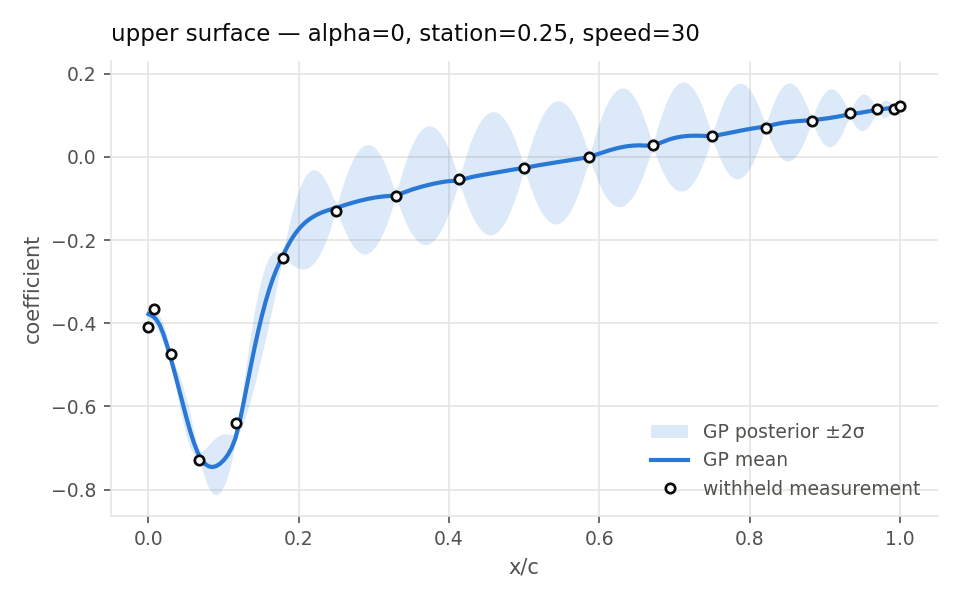
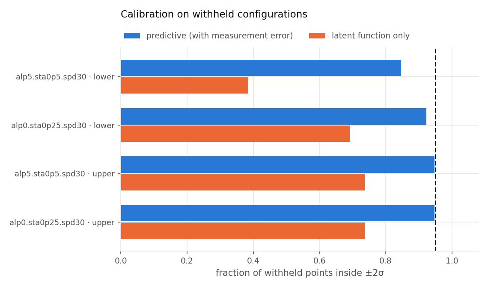
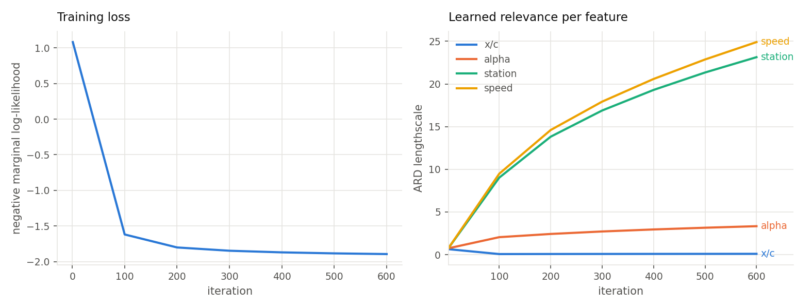

# gp-airload-surrogate — probabilistic surrogates for measured load distributions

An exact Gaussian-process surrogate for chordwise load distributions measured
over a parametric test matrix, with the train/test bookkeeping that decides
whether its accuracy numbers mean anything. Ships with a synthetic dataset, so
`python src/run.py --generate --campaign 1` reproduces every number and figure
below in about a minute on a laptop CPU.

**The problem.** You have a wind-tunnel or CFD campaign: a coefficient measured
at chordwise stations, over a grid of parameters — incidence, spanwise station,
speed, whatever the rig varied. The grid is coarse and expensive, and you want
the response at points nobody ran. A surrogate interpolates it. But a surrogate
that is trained on a point and then scored on it is reporting nothing at all,
and one that reports a mean without an error bar is unusable in a design study
where the whole question is how far you can trust it. Both of those are
bookkeeping problems more than modelling problems, and this repository is mostly
about getting the bookkeeping right.

## What it enforces

Three query types, deliberately handled differently — `src/exclusion.py`:

| query | withheld from training | scored against |
|---|---|---|
| **campaign** — a named validation set | every configuration in it | the held-back measurements |
| **exact** — a request that lands on a grid point | that one configuration | its held-back measurement |
| **interpolated** — a request between grid points | nothing | nothing; there is no truth |

The middle row is the one that gets skipped. If a user asks for a configuration
that happens to exist in the dataset and the model was trained on it, the
"prediction" is a lookup, and the RMSE that comes back is a memorisation score.
The bottom row is the opposite failure: excluding "nearby" points for an
interpolated query throws away exactly the neighbours the prediction rests on.

Queries outside the trained envelope are refused rather than extrapolated:

```
$ python src/run.py --custom "alpha=25,station=0.3,speed=27"
error: query outside the trained envelope: alpha=25.0 outside [-5.0, 10.0]
```

## Model

Exact GP regression in [GPyTorch](https://gpytorch.ai/) — `src/gp.py`. Three
choices, each a statement about the data rather than a default:

**Matérn-3/2, not RBF.** An RBF kernel assumes the underlying function is
infinitely differentiable. A distribution with a sharp leading-edge peak is not,
and imposing that smoothness rings around the peak. Matérn-3/2 assumes
once-differentiable sample paths.

**ARD.** One lengthscale per feature, learned from the marginal likelihood. The
model is not told which parameters matter, and the fitted lengthscales are
readable afterwards as a sensitivity ranking.

**Measured noise, not a fitted scalar.** `FixedNoiseGaussianLikelihood` consumes
the per-point standard errors that came with the measurements. Measurement
quality is not uniform across a surface, and collapsing it to one number makes
the posterior overconfident precisely where the data is worst.

One more, in `src/dataset.py`: every feature is z-scored **except** the
chordwise coordinate. It already lives on [0,1], it is the axis every prediction
is plotted against, and normalising it destroys the physical reading of its
lengthscale.

## Results on the synthetic campaign

`config/demo.yaml` defines a ragged 3-parameter grid (44 valid configurations of
48, since one speed was only run at three of the four incidences) and three
validation campaigns. Withholding campaign 1 and predicting it:



The pinching in the uncertainty band is real, not a rendering artifact, and it
is the most informative thing in the figure. Every configuration in the campaign
samples the *same* chordwise stations, so even with this configuration withheld
the model has seen that value of `x/c` many times over — and has seen nothing at
all between stations. The band collapses where the rig takes data and balloons
where it does not. A surrogate that reported a flat error bar across the chord
would be hiding that.

Per-campaign, over both surfaces:

| campaign | mean RMSE | mean R² | coverage (latent) | coverage (predictive) |
|---|---|---|---|---|
| 1 — interior of the envelope | 0.0103 | +0.990 | 0.638 | **0.916** |
| 2 — two envelope corners | 0.0197 | +0.983 | 0.728 | 0.773 |
| 3 — mixed | 0.0165 | +0.965 | 0.813 | 0.884 |

**On the two coverage columns.** The GP's `σ` is the posterior spread of the
*latent function*. A measurement is that function plus its own error, so scoring
noisy observations against the latent band under-covers by construction —
0.638 against a nominal 0.95 — however well calibrated the model actually is.
The predictive column adds the withheld points' own measurement variance and is
the one that should reach 0.95. Reporting only the first number makes a healthy
model look broken; reporting only the second hides a model whose latent
uncertainty has genuinely collapsed. Both are in the output.



**Where it degrades.** Campaign 2 is not harder because the physics is harder —
it is harder because both of its configurations sit at corners of the parameter
box, with neighbours on one side only. Accuracy roughly doubles in error and
calibration falls to 0.773. That gap between interior and corner performance is
the honest statement of what this surrogate is for: filling in the middle of a
campaign, not reaching past its edges.

**What ARD learned**, upper surface, 600 iterations:

| feature | lengthscale | reading |
|---|---|---|
| `x/c` | 0.098 | dominant — the response varies fastest along the chord |
| `alpha` | 3.34 | moderate |
| `station` | 23.1 | weak |
| `speed` | 24.9 | weakest |

which is the ordering built into the synthetic field, recovered without being
told.



## Using your own data

The parameter grid is configuration, not code. Write a YAML file and point the
tool at it; nothing in `src/` needs to change:

```yaml
root: airloads
features:
  - {name: alpha,   key: alp, values: [-5, 0, 5, 10]}
  - {name: station, key: sta, values: [0.0, 0.25, 0.5, 0.75]}
  - {name: speed,   key: spd, values: [20, 30, 40]}

restrictions:            # test matrices are ragged; describe the holes
  - when:  {speed: 20}
    allow: {alpha: [0, 5, 10]}

campaigns:               # named validation sets
  1:
    - {alpha: 0, station: 0.25, speed: 30}
```

The loader expects HDF5 — MATLAB v7.3 files are HDF5 and read identically —
with one group per configuration, keyed by the encoded parameter values:

```
<root>/alp0/sta0p25/spd30/  coefavgup     (n, 1)   measured coefficient
                            coefstderrup  (n, 1)   its standard error
                            xcup          (n, 1)   chordwise position
                            …low                   same, lower surface
```

Values encode with `-` → `n` and `.` → `p`, so `alpha=-5` is `alpn5` and
`station=0.25` is `sta0p25`. Campaign definitions are validated against the grid
at load time, so a typo in a campaign fails immediately rather than silently
excluding nothing.

## Running it

```bash
pip install -r requirements.txt

python src/run.py --generate --campaign 1              # synthetic data + validation
python src/run.py --custom "alpha=5,station=0.25,speed=30"   # exact  → withheld
python src/run.py --custom "alpha=2.5,station=0.3,speed=27"  # between grid points
python src/run.py --config config/mine.yaml --data mine.h5 --campaign 2
```

Figures and a JSON metrics report land in `figures/`.

## Layout

```
src/config.py      DoE definition, validation, HDF5 key encoding
src/exclusion.py   campaign / exact / interpolated resolution
src/dataset.py     HDF5 traversal, feature assembly, normalization
src/gp.py          ARD Matérn-3/2 exact GP, fixed-noise likelihood, metrics
src/synth.py       synthetic dataset generator
src/plots.py       prediction, diagnostics and calibration figures
src/run.py         CLI
config/demo.yaml   the example design of experiments
```

## Limits

- **Exact GPR is O(n³).** Comfortable into the low thousands of training points.
  Past that, inducing-point or variational GPs are the fix, and are not
  implemented here.
- **One scalar target at a time.** Multi-output correlation across surfaces is
  not modelled; upper and lower are fitted independently.
- **The envelope is a box.** Bounds are checked per feature, so a query inside
  every individual range but outside the convex hull of what was actually run
  will be accepted and answered with more confidence than it deserves.
- **Synthetic data is not validation.** The numbers above show the machinery
  works and is calibrated. They say nothing about any real flow.

## Provenance

This is a generalised, self-contained version of a surrogate framework I wrote
for measured airload data in an academic aeroelasticity setting. The parameter
grid, the model geometry and the measurements from that work are not part of
this repository and are not reproducible from it: everything here runs on the
synthetic generator in `src/synth.py`.

## License

MIT — see [LICENSE](LICENSE).
